# Barter Decision Trees

Generated with `node --experimental-strip-types scripts/barter-decision-tree.ts --depth=6 --maxNodes=120`.

This view shows deduplicated reachable inventory states by turn and all affordable transitions among those states for each selected puzzle date.
## 2026-04-23 — Spice Wharf 🌶️

- Strategy profile: `robust-vs-greedy`
- Goal: 5 🏺 Jade
- Start inventory: 2 🍵 Tea, 200 🪵 Timber, 5 🫖 Porcelain
- Early window trades: 3 · Max trades: 12 · Par: 11
- Graph coverage: 120 states, 167 transitions (depth ≤ 6), capped at 120 states

| Step | Reachable states | Winning states | Avg branching |
|---:|---:|---:|---:|
| 0 | 1 | 0 | 3.00 |
| 1 | 3 | 0 | 2.33 |
| 2 | 6 | 0 | 2.67 |
| 3 | 10 | 0 | 7.10 |
| 4 | 61 | 0 | 6.64 |
| 5 | 39 | 2 | 0.00 |

```mermaid
flowchart TD
  N0["t0 | goal 0/5🏺 | 200🪵 5🫖 2🍵"]
  N1["t1 | goal 0/5🏺 | 200🪵 2🍵 1🫖"]
  N2["t1 | goal 0/5🏺 | 185🪵 5🫖 3🪙"]
  N3["t1 | goal 0/5🏺 | 190🪵 3🪙 2🍵"]
  N4["t2 | goal 0/5🏺 | 185🪵 3🪙 2🍵"]
  N5["t2 | goal 0/5🏺 | 187🪵 3🪙 2🍵"]
  N6["t2 | goal 0/5🏺 | 185🪵 7🫖 2🍵"]
  N7["t2 | goal 0/5🏺 | 170🪵 6🪙 5🫖"]
  N8["t2 | goal 0/5🏺 | 175🪵 6🪙 2🍵"]
  N9["t2 | goal 0/5🏺 | 190🪵 4🫖 2🍵"]
  N10["t3 | goal 0/5🏺 | 185🪵 3🫖 2🍵"]
  N11["t3 | goal 0/5🏺 | 170🪵 6🪙 2🍵"]
  N12["t3 | goal 0/5🏺 | 187🪵 3🫖 2🍵"]
  N13["t3 | goal 0/5🏺 | 172🪵 6🪙 2🍵"]
  N14["t3 | goal 0/5🏺 | 170🪵 7🫖 4🪙"]
  N15["t3 | goal 0/5🏺 | 175🪵 4🫖 4🪙"]
  N16["t3 | goal 0/5🏺 | 155🪵 9🪙 5🫖"]
  N17["t3 | goal 0/5🏺 | 160🪵 9🪙 2🍵"]
  N18["t3 | goal 0/5🏺 | 192🪵 2🍵 1🪙"]
  N19["t3 | goal 0/5🏺 | 180🪵 4🪙 2🍵"]
  N20["t4 | goal 0/5🏺 | 181🪵 3🫖 2🪙"]
  N21["t4 | goal 0/5🏺 | 180🪵 3🫖 2🍵"]
  N22["t4 | goal 0/5🏺 | 167🪵 4🪙 3🫖"]
  N23["t4 | goal 4/5🏺 | 161🪵 4🏺 3🫖"]
  N24["t4 | goal 0/5🏺 | 166🪵 7🪙 1🍵"]
  N25["t4 | goal 0/5🏺 | 165🪵 7🪙 2🍵"]
  N26["t4 | goal 0/5🏺 | 152🪵 9🪙 2🍵"]
  N27["t4 | goal 0/5🏺 | 172🪵 4🪙 2🍵"]
  N28["t4 | goal 0/5🏺 | 170🪵 2🍵 2🪙"]
  N29["t4 | goal 4/5🏺 | 146🪵 6🪙 4🏺"]
  N30["t4 | goal 0/5🏺 | 183🪵 3🫖 2🪙"]
  N31["t4 | goal 0/5🏺 | 182🪵 3🫖 2🍵"]
  N32["t4 | goal 0/5🏺 | 169🪵 4🪙 3🫖"]
  N33["t4 | goal 4/5🏺 | 163🪵 4🏺 3🫖"]
  N34["t4 | goal 0/5🏺 | 168🪵 7🪙 1🍵"]
  N35["t4 | goal 0/5🏺 | 167🪵 7🪙 2🍵"]
  N36["t4 | goal 0/5🏺 | 154🪵 9🪙 2🍵"]
  N37["t4 | goal 0/5🏺 | 174🪵 4🪙 2🍵"]
  N38["t4 | goal 0/5🏺 | 172🪵 2🍵 2🪙"]
  N39["t4 | goal 4/5🏺 | 148🪵 6🪙 4🏺"]
  N40["t4 | goal 0/5🏺 | 166🪵 7🫖 5🪙"]
  N41["t4 | goal 0/5🏺 | 165🪵 7🫖 5🪙"]
  N42["t4 | goal 0/5🏺 | 152🪵 7🫖 7🪙"]
  N43["t4 | goal 0/5🏺 | 172🪵 7🫖 2🍵"]
  N44["t4 | goal 0/5🏺 | 158🪵 7🪙 3🫖"]
  N45["t4 | goal 0/5🏺 | 170🪵 7🫖 2🍵"]
  N46["t4 | goal 4/5🏺 | 146🪵 7🫖 4🪙"]
  N47["t4 | goal 4/5🏺 | 154🪵 4🪙 4🏺"]
  N48["t4 | goal 0/5🏺 | 171🪵 5🪙 4🫖"]
  N49["t4 | goal 0/5🏺 | 170🪵 5🪙 4🫖"]
  N50["t4 | goal 0/5🏺 | 157🪵 7🪙 4🫖"]
  N51["t4 | goal 0/5🏺 | 177🪵 4🫖 2🍵"]
  N52["t4 | goal 0/5🏺 | 163🪵 7🪙 2🍵"]
  N53["t4 | goal 0/5🏺 | 175🪵 4🫖 2🍵"]
  N54["t4 | goal 4/5🏺 | 151🪵 4🫖 4🪙"]
  N55["t4 | goal 0/5🏺 | 151🪵 10🪙 5🫖"]
  N56["t4 | goal 0/5🏺 | 150🪵 10🪙 5🫖"]
  N57["t4 | goal 0/5🏺 | 137🪵 12🪙 5🫖"]
  N58["t4 | goal 0/5🏺 | 157🪵 7🪙 5🫖"]
  N59["t4 | goal 0/5🏺 | 143🪵 12🪙 2🍵"]
  N60["t4 | goal 0/5🏺 | 159🪵 5🫖 2🍵"]
  N61["t4 | goal 0/5🏺 | 155🪵 5🫖 5🪙"]
  N62["t4 | goal 4/5🏺 | 131🪵 9🪙 5🫖"]
  N63["t4 | goal 4/5🏺 | 139🪵 9🪙 4🏺"]
  N64["t4 | goal 0/5🏺 | 156🪵 10🪙 2🫖"]
  N65["t4 | goal 0/5🏺 | 155🪵 10🪙 2🍵"]
  N66["t4 | goal 0/5🏺 | 142🪵 12🪙 2🍵"]
  N67["t4 | goal 0/5🏺 | 162🪵 7🪙 2🍵"]
  N68["t4 | goal 0/5🏺 | 164🪵 2🍵 2🫖"]
  N69["t4 | goal 0/5🏺 | 160🪵 5🪙 2🍵"]
  N70["t4 | goal 4/5🏺 | 136🪵 9🪙 4🏺"]
  N71["t4 | goal 0/5🏺 | 188🪵 2🪙 1🍵"]
  N72["t4 | goal 0/5🏺 | 187🪵 2🍵 2🪙"]
  N73["t4 | goal 0/5🏺 | 174🪵 4🪙 2🍵"]
  N74["t4 | goal 4/5🏺 | 168🪵 4🏺 2🍵"]
  N75["t4 | goal 0/5🏺 | 176🪵 5🪙 1🍵"]
  N76["t4 | goal 0/5🏺 | 175🪵 5🪙 2🍵"]
  N77["t4 | goal 0/5🏺 | 162🪵 7🪙 2🍵"]
  N78["t4 | goal 0/5🏺 | 182🪵 2🍵 2🪙"]
  N79["t4 | goal 0/5🏺 | 180🪵 2🍵 1🫖"]
  N80["t4 | goal 4/5🏺 | 156🪵 4🪙 4🏺"]
  N100["t5 | goal 4/5🏺 | 142🪵 7🪙 4🏺"]
  N101["t5 | goal 0/5🏺 | 160🪵 8🪙 2🍵"]
  N102["t5 | goal 0/5🏺 | 147🪵 10🪙 2🍵"]
  N103["t5 | goal 0/5🏺 | 167🪵 5🪙 2🍵"]
  N104["t5 | goal 0/5🏺 | 165🪵 3🪙 2🍵"]
  N105["t5 | goal 4/5🏺 | 141🪵 7🪙 4🏺"]
  N106["t5 | goal 0/5🏺 | 134🪵 12🪙 2🍵"]
  N107["t5 | goal 0/5🏺 | 154🪵 7🪙 2🍵"]
  N108["t5 | goal 0/5🏺 | 156🪵 2🍵 1🫖"]
  N109["t5 | goal 0/5🏺 | 152🪵 5🪙 2🍵"]
  N110["t5 | goal 4/5🏺 | 128🪵 9🪙 4🏺"]
  N111["t5 | goal 0/5🏺 | 174🪵 2🍵 2🪙"]
  N112["t5 | goal 0/5🏺 | 172🪵 2🍵 1🫖"]
  N113["t5 | goal 4/5🏺 | 148🪵 4🪙 4🏺"]
  N114["t5 | goal 0/5🏺 | 171🪵 2🍵 2🪙"]
  N115["t5 | goal 4/5🏺 | 146🪵 4🏺 2🍵"]
  N116(["t5 | goal 8/5🏺 | 122🪵 8🏺 6🪙 ✅"])
  N117["t5 | goal 0/5🏺 | 179🪵 3🫖 3🪙"]
  N118["t5 | goal 0/5🏺 | 178🪵 3🫖 3🪙"]
  N119["t5 | goal 0/5🏺 | 165🪵 5🪙 3🫖"]
  N81["t5 | goal 0/5🏺 | 177🪵 3🫖 3🪙"]
  N82["t5 | goal 0/5🏺 | 176🪵 3🫖 3🪙"]
  N83["t5 | goal 0/5🏺 | 163🪵 5🪙 3🫖"]
  N84["t5 | goal 0/5🏺 | 183🪵 3🫖 1🍵"]
  N85["t5 | goal 4/5🏺 | 157🪵 4🏺 3🫖"]
  N86["t5 | goal 0/5🏺 | 175🪵 3🫖 3🪙"]
  N87["t5 | goal 0/5🏺 | 162🪵 5🪙 3🫖"]
  N88["t5 | goal 0/5🏺 | 182🪵 3🫖 2🍵"]
  N89["t5 | goal 4/5🏺 | 156🪵 4🏺 3🫖"]
  N90["t5 | goal 0/5🏺 | 149🪵 7🪙 3🫖"]
  N91["t5 | goal 0/5🏺 | 169🪵 3🫖 2🍵"]
  N92["t5 | goal 0/5🏺 | 167🪵 3🫖 2🍵"]
  N93["t5 | goal 4/5🏺 | 143🪵 4🪙 4🏺"]
  N94(["t5 | goal 8/5🏺 | 137🪵 8🏺 3🫖 ✅"])
  N95["t5 | goal 0/5🏺 | 162🪵 8🪙 1🫖"]
  N96["t5 | goal 0/5🏺 | 161🪵 8🪙 1🍵"]
  N97["t5 | goal 0/5🏺 | 148🪵 10🪙 1🍵"]
  N98["t5 | goal 0/5🏺 | 168🪵 5🪙 1🍵"]
  N99["t5 | goal 0/5🏺 | 166🪵 3🪙 1🍵"]
  N0 -->|4🫖→2🪵| N1
  N0 -->|15🪵→3🪙| N2
  N0 -->|10🪵+3🫖→3🪙| N3
  N1 -->|15🪵→3🪙| N4
  N2 -->|4🫖→2🪵| N5
  N2 -->|2🪙→2🫖| N6
  N2 -->|15🪵→3🪙| N7
  N2 -->|10🪵+3🫖→3🪙| N8
  N3 -->|2🪙→2🫖| N9
  N3 -->|15🪵→3🪙| N8
  N4 -->|2🪙→2🫖| N10
  N4 -->|15🪵→3🪙| N11
  N5 -->|2🪙→2🫖| N12
  N5 -->|15🪵→3🪙| N13
  N6 -->|4🫖→2🪵| N12
  N6 -->|15🪵→3🪙| N14
  N6 -->|10🪵+3🫖→3🪙| N15
  N7 -->|4🫖→2🪵| N13
  N7 -->|2🪙→2🫖| N14
  N7 -->|15🪵→3🪙| N16
  N7 -->|10🪵+3🫖→3🪙| N17
  N8 -->|2🪙→2🫖| N15
  N8 -->|15🪵→3🪙| N17
  N9 -->|4🫖→2🪵| N18
  N9 -->|15🪵→3🪙| N15
  N9 -->|10🪵+3🫖→3🪙| N19
  N10 -->|4🪵+1🍵→1🪙| N20
  N10 -->|5🪵→1🪙| N21
  N10 -->|18🪵→3🪙| N22
  N10 -->|18🪵→3🪙| N22
  N10 -->|24🪵→4🏺| N23
  N11 -->|4🪵+1🍵→1🪙| N24
  N11 -->|5🪵→1🪙| N25
  N11 -->|18🪵→3🪙| N26
  N11 -->|2🪙→2🪵| N27
  N11 -->|18🪵→3🪙| N26
  N11 -->|4🪙→1💎| N28
  N11 -->|24🪵→4🏺| N29
  N12 -->|4🪵+1🍵→1🪙| N30
  N12 -->|5🪵→1🪙| N31
  N12 -->|18🪵→3🪙| N32
  N12 -->|18🪵→3🪙| N32
  N12 -->|24🪵→4🏺| N33
  N13 -->|4🪵+1🍵→1🪙| N34
  N13 -->|5🪵→1🪙| N35
  N13 -->|18🪵→3🪙| N36
  N13 -->|2🪙→2🪵| N37
  N13 -->|18🪵→3🪙| N36
  N13 -->|4🪙→1💎| N38
  N13 -->|24🪵→4🏺| N39
  N14 -->|4🪵+1🍵→1🪙| N40
  N14 -->|5🪵→1🪙| N41
  N14 -->|18🪵→3🪙| N42
  N14 -->|2🪙→2🪵| N43
  N14 -->|12🪵+4🫖→3🪙| N44
  N14 -->|18🪵→3🪙| N42
  N14 -->|4🪙→1💎| N45
  N14 -->|24🪵→4🏺| N46
  N14 -->|16🪵+5🫖→4🏺| N47
  N15 -->|4🪵+1🍵→1🪙| N48
  N15 -->|5🪵→1🪙| N49
  N15 -->|18🪵→3🪙| N50
  N15 -->|2🪙→2🪵| N51
  N15 -->|12🪵+4🫖→3🪙| N52
  N15 -->|18🪵→3🪙| N50
  N15 -->|4🪙→1💎| N53
  N15 -->|24🪵→4🏺| N54
  N16 -->|4🪵+1🍵→1🪙| N55
  N16 -->|5🪵→1🪙| N56
  N16 -->|18🪵→3🪙| N57
  N16 -->|2🪙→2🪵| N58
  N16 -->|12🪵+4🫖→3🪙| N59
  N16 -->|18🪵→3🪙| N57
  N16 -->|8🪙→4🪵| N60
  N16 -->|4🪙→1💎| N61
  N16 -->|24🪵→4🏺| N62
  N16 -->|16🪵+5🫖→4🏺| N63
  N17 -->|4🪵+1🍵→1🪙| N64
  N17 -->|5🪵→1🪙| N65
  N17 -->|18🪵→3🪙| N66
  N17 -->|2🪙→2🪵| N67
  N17 -->|18🪵→3🪙| N66
  N17 -->|8🪙→4🪵| N68
  N17 -->|4🪙→1💎| N69
  N17 -->|24🪵→4🏺| N70
  N18 -->|4🪵+1🍵→1🪙| N71
  N18 -->|5🪵→1🪙| N72
  N18 -->|18🪵→3🪙| N73
  N18 -->|18🪵→3🪙| N73
  N18 -->|24🪵→4🏺| N74
  N19 -->|4🪵+1🍵→1🪙| N75
  N19 -->|5🪵→1🪙| N76
  N19 -->|18🪵→3🪙| N77
  N19 -->|2🪙→2🪵| N78
  N19 -->|18🪵→3🪙| N77
  N19 -->|4🪙→1💎| N79
  N19 -->|24🪵→4🏺| N80
  N20 -->|4🪵+1🍵→1🪙| N81
  N20 -->|5🪵→1🪙| N82
  N20 -->|18🪵→3🪙| N83
  N20 -->|2🪙→2🪵| N84
  N20 -->|18🪵→3🪙| N83
  N20 -->|24🪵→4🏺| N85
  N21 -->|4🪵+1🍵→1🪙| N82
  N21 -->|5🪵→1🪙| N86
  N21 -->|18🪵→3🪙| N87
  N21 -->|2🪙→2🪵| N88
  N21 -->|18🪵→3🪙| N87
  N21 -->|24🪵→4🏺| N89
  N22 -->|4🪵+1🍵→1🪙| N83
  N22 -->|5🪵→1🪙| N87
  N22 -->|18🪵→3🪙| N90
  N22 -->|2🪙→2🪵| N91
  N22 -->|18🪵→3🪙| N90
  N22 -->|4🪙→1💎| N92
  N22 -->|24🪵→4🏺| N93
  N23 -->|4🪵+1🍵→1🪙| N85
  N23 -->|5🪵→1🪙| N89
  N23 -->|18🪵→3🪙| N93
  N23 -->|18🪵→3🪙| N93
  N23 -->|24🪵→4🏺| N94
  N24 -->|4🪵+1🍵→1🪙| N95
  N24 -->|5🪵→1🪙| N96
  N24 -->|18🪵→3🪙| N97
  N24 -->|2🪙→2🪵| N98
  N24 -->|18🪵→3🪙| N97
  N24 -->|4🪙→1💎| N99
  N24 -->|24🪵→4🏺| N100
  N25 -->|4🪵+1🍵→1🪙| N96
  N25 -->|5🪵→1🪙| N101
  N25 -->|18🪵→3🪙| N102
  N25 -->|2🪙→2🪵| N103
  N25 -->|18🪵→3🪙| N102
  N25 -->|4🪙→1💎| N104
  N25 -->|24🪵→4🏺| N105
  N26 -->|4🪵+1🍵→1🪙| N97
  N26 -->|5🪵→1🪙| N102
  N26 -->|18🪵→3🪙| N106
  N26 -->|2🪙→2🪵| N107
  N26 -->|18🪵→3🪙| N106
  N26 -->|8🪙→4🪵| N108
  N26 -->|4🪙→1💎| N109
  N26 -->|24🪵→4🏺| N110
  N27 -->|4🪵+1🍵→1🪙| N98
  N27 -->|5🪵→1🪙| N103
  N27 -->|18🪵→3🪙| N107
  N27 -->|2🪙→2🪵| N111
  N27 -->|18🪵→3🪙| N107
  N27 -->|4🪙→1💎| N112
  N27 -->|24🪵→4🏺| N113
  N28 -->|4🪵+1🍵→1🪙| N99
  N28 -->|5🪵→1🪙| N104
  N28 -->|18🪵→3🪙| N109
  N28 -->|2🪙→2🪵| N112
  N28 -->|18🪵→3🪙| N109
  N28 -->|1💎→1🪵| N114
  N28 -->|24🪵→4🏺| N115
  N29 -->|4🪵+1🍵→1🪙| N100
  N29 -->|5🪵→1🪙| N105
  N29 -->|18🪵→3🪙| N110
  N29 -->|2🪙→2🪵| N113
  N29 -->|18🪵→3🪙| N110
  N29 -->|4🪙→1💎| N115
  N29 -->|24🪵→4🏺| N116
  N30 -->|4🪵+1🍵→1🪙| N117
  N30 -->|5🪵→1🪙| N118
  N30 -->|18🪵→3🪙| N119
```

## 2026-04-26 — Porcelain Court 🫖

- Strategy profile: `mixed`
- Goal: 2 💎 Gems
- Start inventory: 200 🧂 Salt, 2 🏺 Jade
- Early window trades: 3 · Max trades: 12 · Par: 11
- Graph coverage: 120 states, 174 transitions (depth ≤ 6), capped at 120 states

| Step | Reachable states | Winning states | Avg branching |
|---:|---:|---:|---:|
| 0 | 1 | 0 | 2.00 |
| 1 | 2 | 0 | 2.00 |
| 2 | 3 | 0 | 2.33 |
| 3 | 5 | 0 | 2.20 |
| 4 | 11 | 0 | 4.00 |
| 5 | 38 | 0 | 3.03 |
| 6 | 60 | 0 | 0.00 |

```mermaid
flowchart TD
  N0["t0 | goal 0/2💎 | 200🧂 2🏺"]
  N1["t1 | goal 0/2💎 | 194🧂 3🌶️ 2🏺"]
  N2["t1 | goal 0/2💎 | 197🧂 2🏺 1🧵"]
  N3["t2 | goal 0/2💎 | 188🧂 6🌶️ 2🏺"]
  N4["t2 | goal 0/2💎 | 191🧂 3🌶️ 2🏺"]
  N5["t2 | goal 0/2💎 | 194🧂 2🧵 2🏺"]
  N10["t3 | goal 0/2💎 | 191🧂 3🧵 2🏺"]
  N6["t3 | goal 0/2💎 | 182🧂 9🌶️ 2🏺"]
  N7["t3 | goal 0/2💎 | 190🧂 2🌶️ 2🏺"]
  N8["t3 | goal 0/2💎 | 185🧂 6🌶️ 2🏺"]
  N9["t3 | goal 0/2💎 | 188🧂 3🌶️ 2🧵"]
  N11["t4 | goal 0/2💎 | 166🧂 9🌶️ 4🧵"]
  N12["t4 | goal 0/2💎 | 180🧂 3🌶️ 3🧵"]
  N13["t4 | goal 0/2💎 | 182🧂 3🧵 2🏺"]
  N14["t4 | goal 0/2💎 | 174🧂 4🧵 2🌶️"]
  N15["t4 | goal 0/2💎 | 169🧂 6🌶️ 5🧵"]
  N16["t4 | goal 0/2💎 | 183🧂 4🧵 2🏺"]
  N17["t4 | goal 0/2💎 | 172🧂 6🧵 3🌶️"]
  N18["t4 | goal 0/2💎 | 187🧂 3🌶️ 2🏺"]
  N19["t4 | goal 0/2💎 | 175🧂 7🧵 2🏺"]
  N20["t4 | goal 0/2💎 | 190🧂 2🏺 1🧵"]
  N21["t4 | goal 0/2💎 | 191🧂 2🏺 1🪙"]
  N22["t5 | goal 0/2💎 | 164🧂 9🌶️ 2🪙"]
  N23["t5 | goal 0/2💎 | 150🧂 9🌶️ 8🧵"]
  N24["t5 | goal 0/2💎 | 166🧂 9🌶️ 2🏺"]
  N25["t5 | goal 0/2💎 | 164🧂 7🧵 3🌶️"]
  N26["t5 | goal 0/2💎 | 165🧂 9🌶️ 2🧵"]
  N27["t5 | goal 0/2💎 | 166🧂 7🧵 2🏺"]
  N28["t5 | goal 0/2💎 | 166🧂 9🌶️ 2🏺"]
  N29["t5 | goal 0/2💎 | 179🧂 3🌶️ 2🏺"]
  N30["t5 | goal 0/2💎 | 180🧂 3🌶️ 2🏺"]
  N31["t5 | goal 0/2💎 | 181🧂 2🏺 1🧵"]
  N32["t5 | goal 0/2💎 | 182🧂 2🏺 1🪙"]
  N33["t5 | goal 0/2💎 | 172🧂 2🌶️ 2🪙"]
  N34["t5 | goal 0/2💎 | 158🧂 8🧵 2🌶️"]
  N35["t5 | goal 0/2💎 | 174🧂 2🌶️ 2🏺"]
  N36["t5 | goal 0/2💎 | 173🧂 2🌶️ 2🧵"]
  N37["t5 | goal 0/2💎 | 174🧂 2🌶️ 2🏺"]
  N38["t5 | goal 0/2💎 | 167🧂 6🌶️ 2🪙"]
  N39["t5 | goal 0/2💎 | 153🧂 9🧵 6🌶️"]
  N40["t5 | goal 0/2💎 | 169🧂 6🌶️ 2🏺"]
  N41["t5 | goal 0/2💎 | 167🧂 8🧵 2🏺"]
  N42["t5 | goal 0/2💎 | 168🧂 6🌶️ 3🧵"]
  N43["t5 | goal 0/2💎 | 169🧂 6🌶️ 2🧵"]
  N44["t5 | goal 0/2💎 | 181🧂 2🪙 2🏺"]
  N45["t5 | goal 0/2💎 | 183🧂 2🏺 1🪙"]
  N46["t5 | goal 0/2💎 | 182🧂 2🧵 2🏺"]
  N47["t5 | goal 0/2💎 | 183🧂 2🏺 1🧵"]
  N48["t5 | goal 0/2💎 | 172🧂 3🌶️ 2🪙"]
  N49["t5 | goal 0/2💎 | 170🧂 3🌶️ 2🧵"]
  N50["t5 | goal 0/2💎 | 156🧂 10🧵 3🌶️"]
  N51["t5 | goal 0/2💎 | 172🧂 3🌶️ 2🧵"]
  N52["t5 | goal 0/2💎 | 171🧂 4🧵 3🌶️"]
  N53["t5 | goal 0/2💎 | 172🧂 3🌶️ 3🧵"]
  N54["t5 | goal 0/2💎 | 175🧂 2🪙 2🏺"]
  N55["t5 | goal 0/2💎 | 173🧂 3🧵 2🪙"]
  N56["t5 | goal 0/2💎 | 159🧂 11🧵 2🏺"]
  N57["t5 | goal 0/2💎 | 175🧂 3🧵 2🏺"]
  N58["t5 | goal 0/2💎 | 174🧂 5🧵 2🏺"]
  N59["t5 | goal 0/2💎 | 175🧂 4🧵 2🏺"]
  N100["t6 | goal 0/2💎 | 181🧂 2🪙 2🏺"]
  N101["t6 | goal 0/2💎 | 156🧂 4🧵 3🌶️"]
  N102["t6 | goal 0/2💎 | 154🧂 6🧵 3🌶️"]
  N103["t6 | goal 0/2💎 | 169🧂 3🌶️ 3🪙"]
  N104["t6 | goal 0/2💎 | 140🧂 14🧵 3🌶️"]
  N105["t6 | goal 0/2💎 | 156🧂 6🧵 3🌶️"]
  N106["t6 | goal 0/2💎 | 155🧂 8🧵 3🌶️"]
  N107["t6 | goal 0/2💎 | 156🧂 7🧵 3🌶️"]
  N108["t6 | goal 0/2💎 | 171🧂 3🌶️ 2🪙"]
  N109["t6 | goal 0/2💎 | 170🧂 3🌶️ 2🧵"]
  N110["t6 | goal 0/2💎 | 171🧂 3🌶️ 2🪙"]
  N111["t6 | goal 0/2💎 | 172🧂 3🌶️ 2🪙"]
  N112["t6 | goal 0/2💎 | 159🧂 5🧵 2🪙"]
  N113["t6 | goal 0/2💎 | 157🧂 7🧵 2🪙"]
  N114["t6 | goal 0/2💎 | 172🧂 3🪙 2🏺"]
  N115["t6 | goal 0/2💎 | 173🧂 3🪙 2🏺"]
  N116["t6 | goal 0/2💎 | 143🧂 15🧵 2🏺"]
  N117["t6 | goal 0/2💎 | 159🧂 7🧵 2🏺"]
  N118["t6 | goal 0/2💎 | 158🧂 9🧵 2🏺"]
  N119["t6 | goal 0/2💎 | 159🧂 8🧵 2🏺"]
  N60["t6 | goal 0/2💎 | 148🧂 9🌶️ 4🧵"]
  N61["t6 | goal 0/2💎 | 162🧂 3🌶️ 3🧵"]
  N62["t6 | goal 0/2💎 | 164🧂 3🧵 2🪙"]
  N63["t6 | goal 0/2💎 | 150🧂 9🌶️ 2🧵"]
  N64["t6 | goal 0/2💎 | 134🧂 12🧵 9🌶️"]
  N65["t6 | goal 0/2💎 | 150🧂 9🌶️ 4🧵"]
  N66["t6 | goal 0/2💎 | 148🧂 11🧵 3🌶️"]
  N67["t6 | goal 0/2💎 | 149🧂 9🌶️ 6🧵"]
  N68["t6 | goal 0/2💎 | 150🧂 11🧵 2🏺"]
  N69["t6 | goal 0/2💎 | 150🧂 9🌶️ 5🧵"]
  N70["t6 | goal 0/2💎 | 164🧂 3🌶️ 3🧵"]
  N71["t6 | goal 0/2💎 | 166🧂 3🧵 2🏺"]
  N72["t6 | goal 0/2💎 | 164🧂 3🌶️ 2🪙"]
  N73["t6 | goal 0/2💎 | 163🧂 5🧵 3🌶️"]
  N74["t6 | goal 0/2💎 | 164🧂 4🧵 3🌶️"]
  N75["t6 | goal 0/2💎 | 164🧂 9🌶️ 2🪙"]
  N76["t6 | goal 0/2💎 | 165🧂 5🧵 2🏺"]
  N77["t6 | goal 0/2💎 | 166🧂 2🪙 2🏺"]
  N78["t6 | goal 0/2💎 | 166🧂 4🧵 2🏺"]
  N79["t6 | goal 0/2💎 | 156🧂 4🧵 2🌶️"]
  N80["t6 | goal 0/2💎 | 158🧂 2🌶️ 2🧵"]
  N81["t6 | goal 0/2💎 | 142🧂 12🧵 2🌶️"]
  N82["t6 | goal 0/2💎 | 158🧂 4🧵 2🌶️"]
  N83["t6 | goal 0/2💎 | 157🧂 6🧵 2🌶️"]
  N84["t6 | goal 0/2💎 | 158🧂 5🧵 2🌶️"]
  N85["t6 | goal 0/2💎 | 172🧂 2🌶️ 2🪙"]
  N86["t6 | goal 0/2💎 | 151🧂 6🌶️ 5🧵"]
  N87["t6 | goal 0/2💎 | 165🧂 4🧵 2🪙"]
  N88["t6 | goal 0/2💎 | 153🧂 6🌶️ 3🧵"]
  N89["t6 | goal 0/2💎 | 137🧂 13🧵 6🌶️"]
  N90["t6 | goal 0/2💎 | 153🧂 6🌶️ 5🧵"]
  N91["t6 | goal 0/2💎 | 151🧂 12🧵 2🏺"]
  N92["t6 | goal 0/2💎 | 152🧂 7🧵 6🌶️"]
  N93["t6 | goal 0/2💎 | 153🧂 6🌶️ 6🧵"]
  N94["t6 | goal 0/2💎 | 167🧂 4🧵 2🏺"]
  N95["t6 | goal 0/2💎 | 167🧂 2🧵 2🪙"]
  N96["t6 | goal 0/2💎 | 166🧂 6🧵 2🏺"]
  N97["t6 | goal 0/2💎 | 167🧂 5🧵 2🏺"]
  N98["t6 | goal 0/2💎 | 167🧂 6🌶️ 2🪙"]
  N99["t6 | goal 0/2💎 | 168🧂 6🌶️ 2🪙"]
  N0 -->|6🧂→3🌶️| N1
  N0 -->|3🧂→1🧵| N2
  N1 -->|6🧂→3🌶️| N3
  N1 -->|3🧂→1🧵| N4
  N2 -->|6🧂→3🌶️| N4
  N2 -->|3🧂→1🧵| N5
  N3 -->|6🧂→3🌶️| N6
  N3 -->|4🌶️→2🧂| N7
  N3 -->|3🧂→1🧵| N8
  N4 -->|6🧂→3🌶️| N8
  N4 -->|3🧂→1🧵| N9
  N5 -->|6🧂→3🌶️| N9
  N5 -->|3🧂→1🧵| N10
  N6 -->|16🧂→4🧵| N11
  N6 -->|6🌶️+2🧂→3🧵| N12
  N6 -->|9🌶️→3🧵| N13
  N7 -->|16🧂→4🧵| N14
  N8 -->|16🧂→4🧵| N15
  N8 -->|6🌶️+2🧂→3🧵| N16
  N9 -->|16🧂→4🧵| N17
  N9 -->|2🧵+1🧂→1🪙| N18
  N10 -->|16🧂→4🧵| N19
  N10 -->|2🧵+1🧂→1🪙| N20
  N10 -->|3🧵→1🪙| N21
  N11 -->|4🧵+2🧂→2🪙| N22
  N11 -->|16🧂→4🧵| N23
  N11 -->|4🧵→1🪙| N24
  N11 -->|6🌶️+2🧂→3🧵| N25
  N11 -->|2🧵+1🧂→1🪙| N26
  N11 -->|9🌶️→3🧵| N27
  N11 -->|3🧵→1🪙| N28
  N12 -->|16🧂→4🧵| N25
  N12 -->|2🧵+1🧂→1🪙| N29
  N12 -->|3🧵→1🪙| N30
  N13 -->|16🧂→4🧵| N27
  N13 -->|2🧵+1🧂→1🪙| N31
  N13 -->|3🧵→1🪙| N32
  N14 -->|4🧵+2🧂→2🪙| N33
  N14 -->|16🧂→4🧵| N34
  N14 -->|4🧵→1🪙| N35
  N14 -->|2🧵+1🧂→1🪙| N36
  N14 -->|3🧵→1🪙| N37
  N15 -->|4🧵+2🧂→2🪙| N38
  N15 -->|16🧂→4🧵| N39
  N15 -->|4🧵→1🪙| N40
  N15 -->|6🌶️+2🧂→3🧵| N41
  N15 -->|2🧵+1🧂→1🪙| N42
  N15 -->|3🧵→1🪙| N43
  N16 -->|4🧵+2🧂→2🪙| N44
  N16 -->|16🧂→4🧵| N41
  N16 -->|4🧵→1🪙| N45
  N16 -->|2🧵+1🧂→1🪙| N46
  N16 -->|3🧵→1🪙| N47
  N17 -->|6🧵→2🪙| N48
  N17 -->|4🧵+2🧂→2🪙| N49
  N17 -->|16🧂→4🧵| N50
  N17 -->|4🧵→1🪙| N51
  N17 -->|2🧵+1🧂→1🪙| N52
  N17 -->|3🧵→1🪙| N53
  N18 -->|16🧂→4🧵| N52
  N19 -->|6🧵→2🪙| N54
  N19 -->|4🧵+2🧂→2🪙| N55
  N19 -->|16🧂→4🧵| N56
  N19 -->|4🧵→1🪙| N57
  N19 -->|2🧵+1🧂→1🪙| N58
  N19 -->|3🧵→1🪙| N59
  N20 -->|16🧂→4🧵| N58
  N21 -->|16🧂→4🧵| N59
  N22 -->|16🧂→4🧵| N60
  N22 -->|6🌶️+2🧂→3🧵| N61
  N22 -->|9🌶️→3🧵| N62
  N23 -->|6🧵→2🪙| N63
  N23 -->|4🧵+2🧂→2🪙| N60
  N23 -->|16🧂→4🧵| N64
  N23 -->|4🧵→1🪙| N65
  N23 -->|6🌶️+2🧂→3🧵| N66
  N23 -->|2🧵+1🧂→1🪙| N67
  N23 -->|9🌶️→3🧵| N68
  N23 -->|3🧵→1🪙| N69
  N24 -->|16🧂→4🧵| N65
  N24 -->|6🌶️+2🧂→3🧵| N70
  N24 -->|9🌶️→3🧵| N71
  N25 -->|6🧵→2🪙| N72
  N25 -->|4🧵+2🧂→2🪙| N61
  N25 -->|16🧂→4🧵| N66
  N25 -->|4🧵→1🪙| N70
  N25 -->|2🧵+1🧂→1🪙| N73
  N25 -->|3🧵→1🪙| N74
  N26 -->|16🧂→4🧵| N67
  N26 -->|6🌶️+2🧂→3🧵| N73
  N26 -->|2🧵+1🧂→1🪙| N75
  N26 -->|9🌶️→3🧵| N76
  N27 -->|6🧵→2🪙| N77
  N27 -->|4🧵+2🧂→2🪙| N62
  N27 -->|16🧂→4🧵| N68
  N27 -->|4🧵→1🪙| N71
  N27 -->|2🧵+1🧂→1🪙| N76
  N27 -->|3🧵→1🪙| N78
  N28 -->|16🧂→4🧵| N69
  N28 -->|6🌶️+2🧂→3🧵| N74
  N28 -->|9🌶️→3🧵| N78
  N29 -->|16🧂→4🧵| N73
  N30 -->|16🧂→4🧵| N74
  N31 -->|16🧂→4🧵| N76
  N32 -->|16🧂→4🧵| N78
  N33 -->|16🧂→4🧵| N79
  N34 -->|6🧵→2🪙| N80
  N34 -->|4🧵+2🧂→2🪙| N79
  N34 -->|16🧂→4🧵| N81
  N34 -->|4🧵→1🪙| N82
  N34 -->|2🧵+1🧂→1🪙| N83
  N34 -->|3🧵→1🪙| N84
  N35 -->|16🧂→4🧵| N82
  N36 -->|16🧂→4🧵| N83
  N36 -->|2🧵+1🧂→1🪙| N85
  N37 -->|16🧂→4🧵| N84
  N38 -->|16🧂→4🧵| N86
  N38 -->|6🌶️+2🧂→3🧵| N87
  N39 -->|6🧵→2🪙| N88
  N39 -->|4🧵+2🧂→2🪙| N86
  N39 -->|16🧂→4🧵| N89
  N39 -->|4🧵→1🪙| N90
  N39 -->|6🌶️+2🧂→3🧵| N91
  N39 -->|2🧵+1🧂→1🪙| N92
  N39 -->|3🧵→1🪙| N93
  N40 -->|16🧂→4🧵| N90
  N40 -->|6🌶️+2🧂→3🧵| N94
  N41 -->|6🧵→2🪙| N95
  N41 -->|4🧵+2🧂→2🪙| N87
  N41 -->|16🧂→4🧵| N91
  N41 -->|4🧵→1🪙| N94
  N41 -->|2🧵+1🧂→1🪙| N96
  N41 -->|3🧵→1🪙| N97
  N42 -->|16🧂→4🧵| N92
  N42 -->|6🌶️+2🧂→3🧵| N96
  N42 -->|2🧵+1🧂→1🪙| N98
  N42 -->|3🧵→1🪙| N99
  N43 -->|16🧂→4🧵| N93
  N43 -->|6🌶️+2🧂→3🧵| N97
  N43 -->|2🧵+1🧂→1🪙| N99
  N44 -->|16🧂→4🧵| N87
  N45 -->|16🧂→4🧵| N94
  N46 -->|16🧂→4🧵| N96
  N46 -->|2🧵+1🧂→1🪙| N100
  N47 -->|16🧂→4🧵| N97
  N48 -->|16🧂→4🧵| N101
  N49 -->|16🧂→4🧵| N102
  N49 -->|2🧵+1🧂→1🪙| N103
  N50 -->|6🧵→2🪙| N101
  N50 -->|4🧵+2🧂→2🪙| N102
  N50 -->|16🧂→4🧵| N104
  N50 -->|4🧵→1🪙| N105
  N50 -->|2🧵+1🧂→1🪙| N106
  N50 -->|3🧵→1🪙| N107
  N51 -->|16🧂→4🧵| N105
  N51 -->|2🧵+1🧂→1🪙| N108
  N52 -->|4🧵+2🧂→2🪙| N103
  N52 -->|16🧂→4🧵| N106
  N52 -->|4🧵→1🪙| N108
  N52 -->|2🧵+1🧂→1🪙| N109
  N52 -->|3🧵→1🪙| N110
  N53 -->|16🧂→4🧵| N107
  N53 -->|2🧵+1🧂→1🪙| N110
  N53 -->|3🧵→1🪙| N111
  N54 -->|16🧂→4🧵| N112
  N55 -->|16🧂→4🧵| N113
  N55 -->|2🧵+1🧂→1🪙| N114
  N55 -->|3🧵→1🪙| N115
  N56 -->|6🧵→2🪙| N112
  N56 -->|4🧵+2🧂→2🪙| N113
  N56 -->|16🧂→4🧵| N116
  N56 -->|4🧵→1🪙| N117
  N56 -->|2🧵+1🧂→1🪙| N118
  N56 -->|3🧵→1🪙| N119
```

## 2026-05-09 — Jade Exchange 🏺

- Strategy profile: `mixed`
- Goal: 7 🏺 Jade
- Start inventory: 2 🍵 Tea, 200 🧂 Salt
- Early window trades: 3 · Max trades: 12 · Par: 11
- Graph coverage: 120 states, 164 transitions (depth ≤ 6), capped at 120 states

| Step | Reachable states | Winning states | Avg branching |
|---:|---:|---:|---:|
| 0 | 1 | 0 | 2.00 |
| 1 | 2 | 0 | 3.00 |
| 2 | 5 | 0 | 2.60 |
| 3 | 7 | 0 | 6.57 |
| 4 | 46 | 0 | 5.82 |
| 5 | 59 | 0 | 0.00 |

```mermaid
flowchart TD
  N0["t0 | goal 0/7🏺 | 200🧂 2🍵"]
  N1["t1 | goal 0/7🏺 | 191🧂 3🫖 2🍵"]
  N2["t1 | goal 0/7🏺 | 188🧂 3🫖 2🍵"]
  N3["t2 | goal 0/7🏺 | 182🧂 6🫖 2🍵"]
  N4["t2 | goal 0/7🏺 | 193🧂 2🍵 1🫖"]
  N5["t2 | goal 0/7🏺 | 179🧂 6🫖 2🍵"]
  N6["t2 | goal 0/7🏺 | 190🧂 2🍵 1🫖"]
  N7["t2 | goal 0/7🏺 | 176🧂 6🫖 2🍵"]
  N10["t3 | goal 0/7🏺 | 170🧂 9🫖 2🍵"]
  N11["t3 | goal 0/7🏺 | 181🧂 4🫖 2🍵"]
  N12["t3 | goal 0/7🏺 | 167🧂 9🫖 2🍵"]
  N13["t3 | goal 0/7🏺 | 178🧂 4🫖 2🍵"]
  N14["t3 | goal 0/7🏺 | 164🧂 9🫖 2🍵"]
  N8["t3 | goal 0/7🏺 | 173🧂 9🫖 2🍵"]
  N9["t3 | goal 0/7🏺 | 184🧂 4🫖 2🍵"]
  N15["t4 | goal 0/7🏺 | 169🧂 11🫖"]
  N16["t4 | goal 2/7🏺 | 173🧂 3🫖 2🍵"]
  N17["t4 | goal 0/7🏺 | 173🧂 6🫖 2🍵"]
  N18["t4 | goal 0/7🏺 | 155🧂 9🫖 3💎"]
  N19["t4 | goal 2/7🏺 | 171🧂 5🫖 2🍵"]
  N20["t4 | goal 0/7🏺 | 172🧂 7🫖 2🍵"]
  N21["t4 | goal 0/7🏺 | 167🧂 11🫖 2🍵"]
  N22["t4 | goal 0/7🏺 | 180🧂 6🫖"]
  N23["t4 | goal 0/7🏺 | 184🧂 2🍵 1🫖"]
  N24["t4 | goal 0/7🏺 | 166🧂 4🫖 3💎"]
  N25["t4 | goal 2/7🏺 | 182🧂 2🍵 2🏺"]
  N26["t4 | goal 0/7🏺 | 183🧂 2🍵 2🫖"]
  N27["t4 | goal 0/7🏺 | 178🧂 6🫖 2🍵"]
  N28["t4 | goal 0/7🏺 | 166🧂 11🫖"]
  N29["t4 | goal 2/7🏺 | 170🧂 3🫖 2🍵"]
  N30["t4 | goal 0/7🏺 | 170🧂 6🫖 2🍵"]
  N31["t4 | goal 0/7🏺 | 152🧂 9🫖 3💎"]
  N32["t4 | goal 2/7🏺 | 168🧂 5🫖 2🍵"]
  N33["t4 | goal 0/7🏺 | 169🧂 7🫖 2🍵"]
  N34["t4 | goal 0/7🏺 | 164🧂 11🫖 2🍵"]
  N35["t4 | goal 0/7🏺 | 177🧂 6🫖"]
  N36["t4 | goal 0/7🏺 | 181🧂 2🍵 1🫖"]
  N37["t4 | goal 0/7🏺 | 163🧂 4🫖 3💎"]
  N38["t4 | goal 2/7🏺 | 179🧂 2🍵 2🏺"]
  N39["t4 | goal 0/7🏺 | 180🧂 2🍵 2🫖"]
  N40["t4 | goal 0/7🏺 | 175🧂 6🫖 2🍵"]
  N41["t4 | goal 0/7🏺 | 163🧂 11🫖"]
  N42["t4 | goal 2/7🏺 | 167🧂 3🫖 2🍵"]
  N43["t4 | goal 0/7🏺 | 167🧂 6🫖 2🍵"]
  N44["t4 | goal 0/7🏺 | 149🧂 9🫖 3💎"]
  N45["t4 | goal 2/7🏺 | 165🧂 5🫖 2🍵"]
  N46["t4 | goal 0/7🏺 | 166🧂 7🫖 2🍵"]
  N47["t4 | goal 0/7🏺 | 161🧂 11🫖 2🍵"]
  N48["t4 | goal 0/7🏺 | 174🧂 6🫖"]
  N49["t4 | goal 0/7🏺 | 178🧂 2🍵 1🫖"]
  N50["t4 | goal 0/7🏺 | 160🧂 4🫖 3💎"]
  N51["t4 | goal 2/7🏺 | 176🧂 2🍵 2🏺"]
  N52["t4 | goal 0/7🏺 | 177🧂 2🍵 2🫖"]
  N53["t4 | goal 0/7🏺 | 172🧂 6🫖 2🍵"]
  N54["t4 | goal 0/7🏺 | 160🧂 11🫖"]
  N55["t4 | goal 2/7🏺 | 164🧂 3🫖 2🍵"]
  N56["t4 | goal 0/7🏺 | 164🧂 6🫖 2🍵"]
  N57["t4 | goal 0/7🏺 | 146🧂 9🫖 3💎"]
  N58["t4 | goal 2/7🏺 | 162🧂 5🫖 2🍵"]
  N59["t4 | goal 0/7🏺 | 163🧂 7🫖 2🍵"]
  N60["t4 | goal 0/7🏺 | 158🧂 11🫖 2🍵"]
  N100["t5 | goal 0/7🏺 | 177🧂 4🫖 2🍵"]
  N101["t5 | goal 2/7🏺 | 178🧂 2🍵 2🏺"]
  N102["t5 | goal 0/7🏺 | 172🧂 8🫖 2🍵"]
  N103["t5 | goal 2/7🏺 | 166🧂 5🫖 2🏺"]
  N104["t5 | goal 0/7🏺 | 166🧂 8🫖 1🪙"]
  N105["t5 | goal 0/7🏺 | 148🧂 11🫖 3💎"]
  N106["t5 | goal 2/7🏺 | 164🧂 7🫖 2🏺"]
  N107["t5 | goal 0/7🏺 | 165🧂 9🫖 1🪙"]
  N108["t5 | goal 0/7🏺 | 160🧂 13🫖"]
  N109["t5 | goal 2/7🏺 | 170🧂 2🍵 2🏺"]
  N110["t5 | goal 2/7🏺 | 152🧂 3🫖 3💎"]
  N111["t5 | goal 2/7🏺 | 169🧂 2🍵 2🏺"]
  N112["t5 | goal 2/7🏺 | 164🧂 5🫖 2🍵"]
  N113["t5 | goal 0/7🏺 | 170🧂 3🫖 2🍵"]
  N114["t5 | goal 0/7🏺 | 152🧂 6🫖 3💎"]
  N115["t5 | goal 2/7🏺 | 168🧂 2🍵 2🫖"]
  N116["t5 | goal 0/7🏺 | 169🧂 4🫖 2🍵"]
  N117["t5 | goal 0/7🏺 | 164🧂 8🫖 2🍵"]
  N118["t5 | goal 0/7🏺 | 134🧂 9🫖 6💎"]
  N119["t5 | goal 2/7🏺 | 150🧂 5🫖 3💎"]
  N61["t5 | goal 2/7🏺 | 169🧂 5🫖 2🏺"]
  N62["t5 | goal 0/7🏺 | 169🧂 8🫖 1🪙"]
  N63["t5 | goal 0/7🏺 | 151🧂 11🫖 3💎"]
  N64["t5 | goal 2/7🏺 | 167🧂 7🫖 2🏺"]
  N65["t5 | goal 0/7🏺 | 168🧂 9🫖 1🪙"]
  N66["t5 | goal 0/7🏺 | 163🧂 13🫖"]
  N67["t5 | goal 2/7🏺 | 173🧂 2🍵 2🏺"]
  N68["t5 | goal 2/7🏺 | 155🧂 3🫖 3💎"]
  N69["t5 | goal 2/7🏺 | 172🧂 2🍵 2🏺"]
  N70["t5 | goal 2/7🏺 | 167🧂 5🫖 2🍵"]
  N71["t5 | goal 0/7🏺 | 173🧂 3🫖 2🍵"]
  N72["t5 | goal 0/7🏺 | 155🧂 6🫖 3💎"]
  N73["t5 | goal 2/7🏺 | 171🧂 2🍵 2🫖"]
  N74["t5 | goal 0/7🏺 | 172🧂 4🫖 2🍵"]
  N75["t5 | goal 0/7🏺 | 167🧂 8🫖 2🍵"]
  N76["t5 | goal 0/7🏺 | 137🧂 9🫖 6💎"]
  N77["t5 | goal 2/7🏺 | 153🧂 5🫖 3💎"]
  N78["t5 | goal 0/7🏺 | 154🧂 7🫖 3💎"]
  N79["t5 | goal 0/7🏺 | 149🧂 11🫖 3💎"]
  N80["t5 | goal 4/7🏺 | 169🧂 4🏺 2🍵"]
  N81["t5 | goal 2/7🏺 | 170🧂 3🫖 2🍵"]
  N82["t5 | goal 2/7🏺 | 165🧂 7🫖 2🍵"]
  N83["t5 | goal 0/7🏺 | 171🧂 5🫖 2🍵"]
  N84["t5 | goal 0/7🏺 | 166🧂 9🫖 2🍵"]
  N85["t5 | goal 0/7🏺 | 161🧂 13🫖 2🍵"]
  N86["t5 | goal 2/7🏺 | 180🧂 2🏺"]
  N87["t5 | goal 0/7🏺 | 180🧂 3🫖 1🪙"]
  N88["t5 | goal 0/7🏺 | 162🧂 6🫖 3💎"]
  N89["t5 | goal 2/7🏺 | 178🧂 2🫖 2🏺"]
  N90["t5 | goal 0/7🏺 | 179🧂 4🫖 1🪙"]
  N91["t5 | goal 0/7🏺 | 174🧂 8🫖"]
  N92["t5 | goal 0/7🏺 | 166🧂 3💎 2🍵"]
  N93["t5 | goal 0/7🏺 | 178🧂 3🫖 2🍵"]
  N94["t5 | goal 0/7🏺 | 148🧂 6💎 4🫖"]
  N95["t5 | goal 2/7🏺 | 164🧂 3💎 2🍵"]
  N96["t5 | goal 0/7🏺 | 165🧂 3💎 2🍵"]
  N97["t5 | goal 0/7🏺 | 160🧂 6🫖 3💎"]
  N98["t5 | goal 2/7🏺 | 176🧂 2🍵 2🫖"]
  N99["t5 | goal 0/7🏺 | 182🧂 2🍵 2🪙"]
  N0 -->|9🧂→3🫖| N1
  N0 -->|12🧂→3🫖| N2
  N1 -->|9🧂→3🫖| N3
  N1 -->|2🫖→2🧂| N4
  N1 -->|12🧂→3🫖| N5
  N2 -->|9🧂→3🫖| N5
  N2 -->|2🫖→2🧂| N6
  N2 -->|12🧂→3🫖| N7
  N3 -->|9🧂→3🫖| N8
  N3 -->|2🫖→2🧂| N9
  N3 -->|12🧂→3🫖| N10
  N4 -->|9🧂→3🫖| N9
  N4 -->|12🧂→3🫖| N11
  N5 -->|9🧂→3🫖| N10
  N5 -->|2🫖→2🧂| N11
  N5 -->|12🧂→3🫖| N12
  N6 -->|9🧂→3🫖| N11
  N6 -->|12🧂→3🫖| N13
  N7 -->|9🧂→3🫖| N12
  N7 -->|2🫖→2🧂| N13
  N7 -->|12🧂→3🫖| N14
  N8 -->|4🧂+2🍵→2🫖| N15
  N8 -->|6🫖→2🏺| N16
  N8 -->|3🫖→1🪙| N17
  N8 -->|18🧂→3💎| N18
  N8 -->|4🫖+2🧂→2🏺| N19
  N8 -->|2🫖+1🧂→1🪙| N20
  N8 -->|6🧂→2🫖| N21
  N9 -->|4🧂+2🍵→2🫖| N22
  N9 -->|3🫖→1🪙| N23
  N9 -->|18🧂→3💎| N24
  N9 -->|4🫖+2🧂→2🏺| N25
  N9 -->|2🫖+1🧂→1🪙| N26
  N9 -->|6🧂→2🫖| N27
  N10 -->|4🧂+2🍵→2🫖| N28
  N10 -->|6🫖→2🏺| N29
  N10 -->|3🫖→1🪙| N30
  N10 -->|18🧂→3💎| N31
  N10 -->|4🫖+2🧂→2🏺| N32
  N10 -->|2🫖+1🧂→1🪙| N33
  N10 -->|6🧂→2🫖| N34
  N11 -->|4🧂+2🍵→2🫖| N35
  N11 -->|3🫖→1🪙| N36
  N11 -->|18🧂→3💎| N37
  N11 -->|4🫖+2🧂→2🏺| N38
  N11 -->|2🫖+1🧂→1🪙| N39
  N11 -->|6🧂→2🫖| N40
  N12 -->|4🧂+2🍵→2🫖| N41
  N12 -->|6🫖→2🏺| N42
  N12 -->|3🫖→1🪙| N43
  N12 -->|18🧂→3💎| N44
  N12 -->|4🫖+2🧂→2🏺| N45
  N12 -->|2🫖+1🧂→1🪙| N46
  N12 -->|6🧂→2🫖| N47
  N13 -->|4🧂+2🍵→2🫖| N48
  N13 -->|3🫖→1🪙| N49
  N13 -->|18🧂→3💎| N50
  N13 -->|4🫖+2🧂→2🏺| N51
  N13 -->|2🫖+1🧂→1🪙| N52
  N13 -->|6🧂→2🫖| N53
  N14 -->|4🧂+2🍵→2🫖| N54
  N14 -->|6🫖→2🏺| N55
  N14 -->|3🫖→1🪙| N56
  N14 -->|18🧂→3💎| N57
  N14 -->|4🫖+2🧂→2🏺| N58
  N14 -->|2🫖+1🧂→1🪙| N59
  N14 -->|6🧂→2🫖| N60
  N15 -->|6🫖→2🏺| N61
  N15 -->|3🫖→1🪙| N62
  N15 -->|18🧂→3💎| N63
  N15 -->|4🫖+2🧂→2🏺| N64
  N15 -->|2🫖+1🧂→1🪙| N65
  N15 -->|6🧂→2🫖| N66
  N16 -->|4🧂+2🍵→2🫖| N61
  N16 -->|3🫖→1🪙| N67
  N16 -->|18🧂→3💎| N68
  N16 -->|2🫖+1🧂→1🪙| N69
  N16 -->|6🧂→2🫖| N70
  N17 -->|4🧂+2🍵→2🫖| N62
  N17 -->|6🫖→2🏺| N67
  N17 -->|3🫖→1🪙| N71
  N17 -->|18🧂→3💎| N72
  N17 -->|4🫖+2🧂→2🏺| N73
  N17 -->|2🫖+1🧂→1🪙| N74
  N17 -->|6🧂→2🫖| N75
  N18 -->|4🧂+2🍵→2🫖| N63
  N18 -->|6🫖→2🏺| N68
  N18 -->|3🫖→1🪙| N72
  N18 -->|18🧂→3💎| N76
  N18 -->|4🫖+2🧂→2🏺| N77
  N18 -->|2🫖+1🧂→1🪙| N78
  N18 -->|6🧂→2🫖| N79
  N19 -->|4🧂+2🍵→2🫖| N64
  N19 -->|3🫖→1🪙| N73
  N19 -->|18🧂→3💎| N77
  N19 -->|4🫖+2🧂→2🏺| N80
  N19 -->|2🫖+1🧂→1🪙| N81
  N19 -->|6🧂→2🫖| N82
  N20 -->|4🧂+2🍵→2🫖| N65
  N20 -->|6🫖→2🏺| N69
  N20 -->|3🫖→1🪙| N74
  N20 -->|18🧂→3💎| N78
  N20 -->|4🫖+2🧂→2🏺| N81
  N20 -->|2🫖+1🧂→1🪙| N83
  N20 -->|6🧂→2🫖| N84
  N21 -->|4🧂+2🍵→2🫖| N66
  N21 -->|6🫖→2🏺| N70
  N21 -->|3🫖→1🪙| N75
  N21 -->|18🧂→3💎| N79
  N21 -->|4🫖+2🧂→2🏺| N82
  N21 -->|2🫖+1🧂→1🪙| N84
  N21 -->|6🧂→2🫖| N85
  N22 -->|6🫖→2🏺| N86
  N22 -->|3🫖→1🪙| N87
  N22 -->|18🧂→3💎| N88
  N22 -->|4🫖+2🧂→2🏺| N89
  N22 -->|2🫖+1🧂→1🪙| N90
  N22 -->|6🧂→2🫖| N91
  N23 -->|4🧂+2🍵→2🫖| N87
  N23 -->|18🧂→3💎| N92
  N23 -->|6🧂→2🫖| N93
  N24 -->|4🧂+2🍵→2🫖| N88
  N24 -->|3🫖→1🪙| N92
  N24 -->|18🧂→3💎| N94
  N24 -->|4🫖+2🧂→2🏺| N95
  N24 -->|2🫖+1🧂→1🪙| N96
  N24 -->|6🧂→2🫖| N97
  N25 -->|4🧂+2🍵→2🫖| N89
  N25 -->|18🧂→3💎| N95
  N25 -->|6🧂→2🫖| N98
  N26 -->|4🧂+2🍵→2🫖| N90
  N26 -->|18🧂→3💎| N96
  N26 -->|2🫖+1🧂→1🪙| N99
  N26 -->|6🧂→2🫖| N100
  N27 -->|4🧂+2🍵→2🫖| N91
  N27 -->|6🫖→2🏺| N101
  N27 -->|3🫖→1🪙| N93
  N27 -->|18🧂→3💎| N97
  N27 -->|4🫖+2🧂→2🏺| N98
  N27 -->|2🫖+1🧂→1🪙| N100
  N27 -->|6🧂→2🫖| N102
  N28 -->|6🫖→2🏺| N103
  N28 -->|3🫖→1🪙| N104
  N28 -->|18🧂→3💎| N105
  N28 -->|4🫖+2🧂→2🏺| N106
  N28 -->|2🫖+1🧂→1🪙| N107
  N28 -->|6🧂→2🫖| N108
  N29 -->|4🧂+2🍵→2🫖| N103
  N29 -->|3🫖→1🪙| N109
  N29 -->|18🧂→3💎| N110
  N29 -->|2🫖+1🧂→1🪙| N111
  N29 -->|6🧂→2🫖| N112
  N30 -->|4🧂+2🍵→2🫖| N104
  N30 -->|6🫖→2🏺| N109
  N30 -->|3🫖→1🪙| N113
  N30 -->|18🧂→3💎| N114
  N30 -->|4🫖+2🧂→2🏺| N115
  N30 -->|2🫖+1🧂→1🪙| N116
  N30 -->|6🧂→2🫖| N117
  N31 -->|4🧂+2🍵→2🫖| N105
  N31 -->|6🫖→2🏺| N110
  N31 -->|3🫖→1🪙| N114
  N31 -->|18🧂→3💎| N118
  N31 -->|4🫖+2🧂→2🏺| N119
```

## 2026-05-25 — Atlas Bazaar 🗺️

- Strategy profile: `robust-vs-greedy`
- Goal: 4 🏺 Jade
- Start inventory: 200 🌶️ Spice, 2 🧶 Wool
- Early window trades: 3 · Max trades: 12 · Par: 8
- Graph coverage: 120 states, 179 transitions (depth ≤ 6), capped at 120 states

| Step | Reachable states | Winning states | Avg branching |
|---:|---:|---:|---:|
| 0 | 1 | 0 | 3.00 |
| 1 | 3 | 0 | 3.33 |
| 2 | 7 | 0 | 3.14 |
| 3 | 11 | 0 | 3.45 |
| 4 | 38 | 0 | 3.06 |
| 5 | 60 | 0 | 0.00 |

```mermaid
flowchart TD
  N0["t0 | goal 0/4🏺 | 200🌶️ 2🧶"]
  N1["t1 | goal 0/4🏺 | 184🌶️ 4🧵 2🧶"]
  N2["t1 | goal 0/4🏺 | 192🌶️ 4🍵 2🧶"]
  N3["t1 | goal 0/4🏺 | 194🌶️ 4🍵"]
  N10["t2 | goal 0/4🏺 | 195🌶️"]
  N4["t2 | goal 0/4🏺 | 168🌶️ 8🧵 2🧶"]
  N5["t2 | goal 0/4🏺 | 176🌶️ 4🍵 4🧵"]
  N6["t2 | goal 0/4🏺 | 178🌶️ 4🍵 4🧵"]
  N7["t2 | goal 0/4🏺 | 193🌶️ 2🧶"]
  N8["t2 | goal 0/4🏺 | 184🌶️ 8🍵 2🧶"]
  N9["t2 | goal 0/4🏺 | 186🌶️ 8🍵"]
  N11["t3 | goal 0/4🏺 | 152🌶️ 12🧵 2🧶"]
  N12["t3 | goal 0/4🏺 | 160🌶️ 8🧵 4🍵"]
  N13["t3 | goal 0/4🏺 | 162🌶️ 8🧵 4🍵"]
  N14["t3 | goal 0/4🏺 | 177🌶️ 4🧵 2🧶"]
  N15["t3 | goal 0/4🏺 | 168🌶️ 8🍵 4🧵"]
  N16["t3 | goal 0/4🏺 | 170🌶️ 8🍵 4🧵"]
  N17["t3 | goal 0/4🏺 | 179🌶️ 4🧵"]
  N18["t3 | goal 0/4🏺 | 185🌶️ 4🍵 2🧶"]
  N19["t3 | goal 0/4🏺 | 187🌶️ 4🍵"]
  N20["t3 | goal 0/4🏺 | 176🌶️ 12🍵 2🧶"]
  N21["t3 | goal 0/4🏺 | 178🌶️ 12🍵"]
  N22["t4 | goal 0/4🏺 | 149🌶️ 13🧵 1🧶"]
  N23["t4 | goal 0/4🏺 | 152🌶️ 8🧵 2🧶"]
  N24["t4 | goal 2/4🏺 | 152🌶️ 6🧵 2🏺"]
  N25["t4 | goal 2/4🏺 | 152🌶️ 4🧵 2🧶"]
  N26["t4 | goal 0/4🏺 | 151🌶️ 9🧵 2🧶"]
  N27["t4 | goal 0/4🏺 | 148🌶️ 13🧵 2🧶"]
  N28["t4 | goal 0/4🏺 | 157🌶️ 9🧵 4🍵"]
  N29["t4 | goal 0/4🏺 | 160🌶️ 4🍵 4🧵"]
  N30["t4 | goal 2/4🏺 | 160🌶️ 4🍵 2🧵"]
  N31["t4 | goal 2/4🏺 | 160🌶️ 4🍵 2🧶"]
  N32["t4 | goal 0/4🏺 | 159🌶️ 5🧵 4🍵"]
  N33["t4 | goal 0/4🏺 | 156🌶️ 9🧵 4🍵"]
  N34["t4 | goal 0/4🏺 | 162🌶️ 4🍵 4🧵"]
  N35["t4 | goal 2/4🏺 | 162🌶️ 4🍵 2🏺"]
  N36["t4 | goal 0/4🏺 | 161🌶️ 5🧵 4🍵"]
  N37["t4 | goal 0/4🏺 | 158🌶️ 9🧵 4🍵"]
  N38["t4 | goal 0/4🏺 | 174🌶️ 5🧵 1🧶"]
  N39["t4 | goal 0/4🏺 | 177🌶️ 2🧶 1🪙"]
  N40["t4 | goal 0/4🏺 | 176🌶️ 2🧶 1🧵"]
  N41["t4 | goal 0/4🏺 | 173🌶️ 5🧵 2🧶"]
  N42["t4 | goal 0/4🏺 | 165🌶️ 8🍵 5🧵"]
  N43["t4 | goal 0/4🏺 | 168🌶️ 8🍵 2🧶"]
  N44["t4 | goal 0/4🏺 | 167🌶️ 8🍵 2🧶"]
  N45["t4 | goal 0/4🏺 | 164🌶️ 8🍵 5🧵"]
  N46["t4 | goal 0/4🏺 | 170🌶️ 8🍵 1🪙"]
  N47["t4 | goal 0/4🏺 | 169🌶️ 8🍵 1🧵"]
  N48["t4 | goal 0/4🏺 | 166🌶️ 8🍵 5🧵"]
  N49["t4 | goal 0/4🏺 | 179🌶️ 1🪙"]
  N50["t4 | goal 0/4🏺 | 178🌶️ 1🧵 1🪙"]
  N51["t4 | goal 0/4🏺 | 175🌶️ 5🧵"]
  N52["t4 | goal 0/4🏺 | 182🌶️ 4🍵 1🧶"]
  N53["t4 | goal 0/4🏺 | 181🌶️ 4🍵 2🧶"]
  N54["t4 | goal 0/4🏺 | 183🌶️ 4🍵 1🧵"]
  N55["t4 | goal 0/4🏺 | 179🌶️ 2🧶"]
  N56["t4 | goal 0/4🏺 | 173🌶️ 12🍵 1🧶"]
  N57["t4 | goal 0/4🏺 | 172🌶️ 12🍵 2🧶"]
  N58["t4 | goal 0/4🏺 | 181🌶️"]
  N59["t4 | goal 0/4🏺 | 174🌶️ 12🍵 1🧵"]
  N100["t5 | goal 0/4🏺 | 173🌶️ 2🧶 1🧵"]
  N101["t5 | goal 0/4🏺 | 172🌶️ 2🧶 2🧵"]
  N102["t5 | goal 0/4🏺 | 169🌶️ 6🧵 2🧶"]
  N103["t5 | goal 0/4🏺 | 162🌶️ 8🍵 6🧵"]
  N104["t5 | goal 0/4🏺 | 165🌶️ 8🍵 1🧶"]
  N105["t5 | goal 0/4🏺 | 164🌶️ 8🍵 2🧵"]
  N106["t5 | goal 0/4🏺 | 161🌶️ 8🍵 6🧵"]
  N107["t5 | goal 0/4🏺 | 164🌶️ 8🍵 2🧶"]
  N108["t5 | goal 0/4🏺 | 163🌶️ 8🍵 2🧶"]
  N109["t5 | goal 0/4🏺 | 160🌶️ 8🍵 6🧵"]
  N110["t5 | goal 0/4🏺 | 166🌶️ 8🍵 1🧵"]
  N111["t5 | goal 0/4🏺 | 165🌶️ 8🍵 2🧵"]
  N112["t5 | goal 0/4🏺 | 175🌶️ 1🧵 1🪙"]
  N113["t5 | goal 0/4🏺 | 174🌶️ 2🧵 1🪙"]
  N114["t5 | goal 0/4🏺 | 179🌶️ 4🍵 2🧵"]
  N115["t5 | goal 0/4🏺 | 178🌶️ 4🍵 2🧵"]
  N116["t5 | goal 0/4🏺 | 177🌶️ 4🍵 2🧶"]
  N117["t5 | goal 0/4🏺 | 176🌶️ 1🧶 1🧵"]
  N118["t5 | goal 0/4🏺 | 175🌶️ 2🧶 1🧵"]
  N119["t5 | goal 0/4🏺 | 170🌶️ 12🍵 2🧵"]
  N60["t5 | goal 0/4🏺 | 146🌶️ 14🧵"]
  N61["t5 | goal 0/4🏺 | 149🌶️ 9🧵 1🧶"]
  N62["t5 | goal 2/4🏺 | 149🌶️ 5🧵 2🏺"]
  N63["t5 | goal 0/4🏺 | 148🌶️ 10🧵 1🧶"]
  N64["t5 | goal 0/4🏺 | 145🌶️ 14🧵 1🧶"]
  N65["t5 | goal 0/4🏺 | 152🌶️ 4🧵 2🧶"]
  N66["t5 | goal 2/4🏺 | 152🌶️ 2🧵 2🏺"]
  N67["t5 | goal 2/4🏺 | 152🌶️ 2🧶 2🏺"]
  N68["t5 | goal 0/4🏺 | 151🌶️ 5🧵 2🧶"]
  N69["t5 | goal 0/4🏺 | 148🌶️ 9🧵 2🧶"]
  N70["t5 | goal 2/4🏺 | 151🌶️ 3🧵 2🏺"]
  N71["t5 | goal 2/4🏺 | 148🌶️ 7🧵 2🏺"]
  N72["t5 | goal 2/4🏺 | 151🌶️ 2🧶 2🏺"]
  N73["t5 | goal 2/4🏺 | 148🌶️ 5🧵 2🧶"]
  N74["t5 | goal 0/4🏺 | 150🌶️ 6🧵 2🧶"]
  N75["t5 | goal 0/4🏺 | 147🌶️ 10🧵 2🧶"]
  N76["t5 | goal 0/4🏺 | 144🌶️ 14🧵 2🧶"]
  N77["t5 | goal 0/4🏺 | 154🌶️ 10🧵 4🍵"]
  N78["t5 | goal 0/4🏺 | 157🌶️ 5🧵 4🍵"]
  N79["t5 | goal 2/4🏺 | 157🌶️ 4🍵 2🏺"]
  N80["t5 | goal 0/4🏺 | 156🌶️ 6🧵 4🍵"]
  N81["t5 | goal 0/4🏺 | 153🌶️ 10🧵 4🍵"]
  N82["t5 | goal 0/4🏺 | 160🌶️ 4🍵 2🧶"]
  N83["t5 | goal 0/4🏺 | 159🌶️ 4🍵 2🧶"]
  N84["t5 | goal 0/4🏺 | 156🌶️ 5🧵 4🍵"]
  N85["t5 | goal 2/4🏺 | 156🌶️ 4🍵 3🧵"]
  N86["t5 | goal 2/4🏺 | 156🌶️ 4🍵 2🧶"]
  N87["t5 | goal 0/4🏺 | 158🌶️ 4🍵 2🧶"]
  N88["t5 | goal 0/4🏺 | 155🌶️ 6🧵 4🍵"]
  N89["t5 | goal 0/4🏺 | 152🌶️ 10🧵 4🍵"]
  N90["t5 | goal 0/4🏺 | 162🌶️ 4🍵 2🪙"]
  N91["t5 | goal 0/4🏺 | 161🌶️ 4🍵 2🪙"]
  N92["t5 | goal 0/4🏺 | 158🌶️ 5🧵 4🍵"]
  N93["t5 | goal 2/4🏺 | 158🌶️ 4🍵 2🏺"]
  N94["t5 | goal 0/4🏺 | 160🌶️ 4🍵 2🧵"]
  N95["t5 | goal 0/4🏺 | 157🌶️ 6🧵 4🍵"]
  N96["t5 | goal 0/4🏺 | 171🌶️ 6🧵"]
  N97["t5 | goal 0/4🏺 | 174🌶️ 1🧶 1🧵"]
  N98["t5 | goal 0/4🏺 | 173🌶️ 2🧵 1🧶"]
  N99["t5 | goal 0/4🏺 | 170🌶️ 6🧵 1🧶"]
  N0 -->|16🌶️→4🧵| N1
  N0 -->|8🌶️→4🍵| N2
  N0 -->|6🌶️+2🧶→4🍵| N3
  N1 -->|16🌶️→4🧵| N4
  N1 -->|8🌶️→4🍵| N5
  N1 -->|6🌶️+2🧶→4🍵| N6
  N2 -->|4🍵→1🌶️| N7
  N2 -->|16🌶️→4🧵| N5
  N2 -->|8🌶️→4🍵| N8
  N2 -->|6🌶️+2🧶→4🍵| N9
  N3 -->|4🍵→1🌶️| N10
  N3 -->|16🌶️→4🧵| N6
  N3 -->|8🌶️→4🍵| N9
  N4 -->|16🌶️→4🧵| N11
  N4 -->|8🌶️→4🍵| N12
  N4 -->|6🌶️+2🧶→4🍵| N13
  N5 -->|4🍵→1🌶️| N14
  N5 -->|16🌶️→4🧵| N12
  N5 -->|8🌶️→4🍵| N15
  N5 -->|6🌶️+2🧶→4🍵| N16
  N6 -->|4🍵→1🌶️| N17
  N6 -->|16🌶️→4🧵| N13
  N6 -->|8🌶️→4🍵| N16
  N7 -->|16🌶️→4🧵| N14
  N7 -->|8🌶️→4🍵| N18
  N7 -->|6🌶️+2🧶→4🍵| N19
  N8 -->|4🍵→1🌶️| N18
  N8 -->|16🌶️→4🧵| N15
  N8 -->|8🌶️→4🍵| N20
  N8 -->|6🌶️+2🧶→4🍵| N21
  N9 -->|4🍵→1🌶️| N19
  N9 -->|16🌶️→4🧵| N16
  N9 -->|8🌶️→4🍵| N21
  N10 -->|16🌶️→4🧵| N17
  N10 -->|8🌶️→4🍵| N19
  N11 -->|3🌶️+1🧶→1🧵| N22
  N11 -->|4🧵→1🪙| N23
  N11 -->|6🧵+2🧶→2🏺| N24
  N11 -->|8🧵→2🏺| N25
  N11 -->|3🧵+1🌶️→1🪙| N26
  N11 -->|4🌶️→1🧵| N27
  N12 -->|3🌶️+1🧶→1🧵| N28
  N12 -->|4🧵→1🪙| N29
  N12 -->|6🧵+2🧶→2🏺| N30
  N12 -->|8🧵→2🏺| N31
  N12 -->|3🧵+1🌶️→1🪙| N32
  N12 -->|4🌶️→1🧵| N33
  N13 -->|4🧵→1🪙| N34
  N13 -->|8🧵→2🏺| N35
  N13 -->|3🧵+1🌶️→1🪙| N36
  N13 -->|4🌶️→1🧵| N37
  N14 -->|3🌶️+1🧶→1🧵| N38
  N14 -->|4🧵→1🪙| N39
  N14 -->|3🧵+1🌶️→1🪙| N40
  N14 -->|4🌶️→1🧵| N41
  N15 -->|3🌶️+1🧶→1🧵| N42
  N15 -->|4🧵→1🪙| N43
  N15 -->|3🧵+1🌶️→1🪙| N44
  N15 -->|4🌶️→1🧵| N45
  N16 -->|4🧵→1🪙| N46
  N16 -->|3🧵+1🌶️→1🪙| N47
  N16 -->|4🌶️→1🧵| N48
  N17 -->|4🧵→1🪙| N49
  N17 -->|3🧵+1🌶️→1🪙| N50
  N17 -->|4🌶️→1🧵| N51
  N18 -->|3🌶️+1🧶→1🧵| N52
  N18 -->|4🌶️→1🧵| N53
  N19 -->|4🌶️→1🧵| N54
  N20 -->|12🍵→3🌶️| N55
  N20 -->|3🌶️+1🧶→1🧵| N56
  N20 -->|4🌶️→1🧵| N57
  N21 -->|12🍵→3🌶️| N58
  N21 -->|4🌶️→1🧵| N59
  N22 -->|3🌶️+1🧶→1🧵| N60
  N22 -->|4🧵→1🪙| N61
  N22 -->|8🧵→2🏺| N62
  N22 -->|3🧵+1🌶️→1🪙| N63
  N22 -->|4🌶️→1🧵| N64
  N23 -->|3🌶️+1🧶→1🧵| N61
  N23 -->|4🧵→1🪙| N65
  N23 -->|6🧵+2🧶→2🏺| N66
  N23 -->|8🧵→2🏺| N67
  N23 -->|3🧵+1🌶️→1🪙| N68
  N23 -->|4🌶️→1🧵| N69
  N24 -->|4🧵→1🪙| N66
  N24 -->|3🧵+1🌶️→1🪙| N70
  N24 -->|4🌶️→1🧵| N71
  N25 -->|3🌶️+1🧶→1🧵| N62
  N25 -->|4🧵→1🪙| N67
  N25 -->|3🧵+1🌶️→1🪙| N72
  N25 -->|4🌶️→1🧵| N73
  N26 -->|3🌶️+1🧶→1🧵| N63
  N26 -->|4🧵→1🪙| N68
  N26 -->|6🧵+2🧶→2🏺| N70
  N26 -->|8🧵→2🏺| N72
  N26 -->|3🧵+1🌶️→1🪙| N74
  N26 -->|4🌶️→1🧵| N75
  N27 -->|3🌶️+1🧶→1🧵| N64
  N27 -->|4🧵→1🪙| N69
  N27 -->|6🧵+2🧶→2🏺| N71
  N27 -->|8🧵→2🏺| N73
  N27 -->|3🧵+1🌶️→1🪙| N75
  N27 -->|4🌶️→1🧵| N76
  N28 -->|3🌶️+1🧶→1🧵| N77
  N28 -->|4🧵→1🪙| N78
  N28 -->|8🧵→2🏺| N79
  N28 -->|3🧵+1🌶️→1🪙| N80
  N28 -->|4🌶️→1🧵| N81
  N29 -->|3🌶️+1🧶→1🧵| N78
  N29 -->|4🧵→1🪙| N82
  N29 -->|3🧵+1🌶️→1🪙| N83
  N29 -->|4🌶️→1🧵| N84
  N30 -->|4🌶️→1🧵| N85
  N31 -->|3🌶️+1🧶→1🧵| N79
  N31 -->|4🌶️→1🧵| N86
  N32 -->|3🌶️+1🧶→1🧵| N80
  N32 -->|4🧵→1🪙| N83
  N32 -->|3🧵+1🌶️→1🪙| N87
  N32 -->|4🌶️→1🧵| N88
  N33 -->|3🌶️+1🧶→1🧵| N81
  N33 -->|4🧵→1🪙| N84
  N33 -->|6🧵+2🧶→2🏺| N85
  N33 -->|8🧵→2🏺| N86
  N33 -->|3🧵+1🌶️→1🪙| N88
  N33 -->|4🌶️→1🧵| N89
  N34 -->|4🧵→1🪙| N90
  N34 -->|3🧵+1🌶️→1🪙| N91
  N34 -->|4🌶️→1🧵| N92
  N35 -->|4🌶️→1🧵| N93
  N36 -->|4🧵→1🪙| N91
  N36 -->|3🧵+1🌶️→1🪙| N94
  N36 -->|4🌶️→1🧵| N95
  N37 -->|4🧵→1🪙| N92
  N37 -->|8🧵→2🏺| N93
  N37 -->|3🧵+1🌶️→1🪙| N95
  N37 -->|4🌶️→1🧵| N77
  N38 -->|3🌶️+1🧶→1🧵| N96
  N38 -->|4🧵→1🪙| N97
  N38 -->|3🧵+1🌶️→1🪙| N98
  N38 -->|4🌶️→1🧵| N99
  N39 -->|3🌶️+1🧶→1🧵| N97
  N39 -->|4🌶️→1🧵| N100
  N40 -->|3🌶️+1🧶→1🧵| N98
  N40 -->|4🌶️→1🧵| N101
  N41 -->|3🌶️+1🧶→1🧵| N99
  N41 -->|4🧵→1🪙| N100
  N41 -->|3🧵+1🌶️→1🪙| N101
  N41 -->|4🌶️→1🧵| N102
  N42 -->|3🌶️+1🧶→1🧵| N103
  N42 -->|4🧵→1🪙| N104
  N42 -->|3🧵+1🌶️→1🪙| N105
  N42 -->|4🌶️→1🧵| N106
  N43 -->|3🌶️+1🧶→1🧵| N104
  N43 -->|4🌶️→1🧵| N107
  N44 -->|3🌶️+1🧶→1🧵| N105
  N44 -->|4🌶️→1🧵| N108
  N45 -->|3🌶️+1🧶→1🧵| N106
  N45 -->|4🧵→1🪙| N107
  N45 -->|3🧵+1🌶️→1🪙| N108
  N45 -->|4🌶️→1🧵| N109
  N46 -->|4🌶️→1🧵| N110
  N47 -->|4🌶️→1🧵| N111
  N48 -->|4🧵→1🪙| N110
  N48 -->|3🧵+1🌶️→1🪙| N111
  N48 -->|4🌶️→1🧵| N103
  N49 -->|4🌶️→1🧵| N112
  N50 -->|4🌶️→1🧵| N113
  N51 -->|4🧵→1🪙| N112
  N51 -->|3🧵+1🌶️→1🪙| N113
  N51 -->|4🌶️→1🧵| N96
  N52 -->|3🌶️+1🧶→1🧵| N114
  N52 -->|4🌶️→1🧵| N115
  N53 -->|3🌶️+1🧶→1🧵| N115
  N53 -->|4🌶️→1🧵| N116
  N54 -->|4🌶️→1🧵| N114
  N55 -->|3🌶️+1🧶→1🧵| N117
  N55 -->|4🌶️→1🧵| N118
  N56 -->|12🍵→3🌶️| N117
  N56 -->|3🌶️+1🧶→1🧵| N119
```

## 2026-06-18 — Amber Row 🟠

- Strategy profile: `robust-vs-greedy`
- Goal: 2 💎 Gems
- Start inventory: 200 🌶️ Spice, 2 🧂 Salt
- Early window trades: 3 · Max trades: 12 · Par: 10
- Graph coverage: 56 states, 69 transitions (depth ≤ 6)

| Step | Reachable states | Winning states | Avg branching |
|---:|---:|---:|---:|
| 0 | 1 | 0 | 3.00 |
| 1 | 3 | 0 | 3.00 |
| 2 | 6 | 0 | 3.33 |
| 3 | 12 | 0 | 1.67 |
| 4 | 20 | 0 | 0.70 |
| 5 | 11 | 0 | 0.27 |
| 6 | 3 | 0 | 0.00 |

```mermaid
flowchart TD
  N0["t0 | goal 0/2💎 | 200🌶️ 2🧂"]
  N1["t1 | goal 0/2💎 | 194🌶️ 2🧂 2🫖"]
  N2["t1 | goal 0/2💎 | 198🌶️ 1🧂 1🫖"]
  N3["t1 | goal 0/2💎 | 197🌶️ 2🧂 1🫖"]
  N4["t2 | goal 0/2💎 | 188🌶️ 4🫖 2🧂"]
  N5["t2 | goal 0/2💎 | 192🌶️ 3🫖 1🧂"]
  N6["t2 | goal 0/2💎 | 191🌶️ 3🫖 2🧂"]
  N7["t2 | goal 0/2💎 | 196🌶️ 2🫖"]
  N8["t2 | goal 0/2💎 | 195🌶️ 2🫖 1🧂"]
  N9["t2 | goal 0/2💎 | 194🌶️ 2🧂 2🫖"]
  N10["t3 | goal 0/2💎 | 191🌶️ 2🧂 1🫖"]
  N11["t3 | goal 0/2💎 | 182🌶️ 6🫖 2🧂"]
  N12["t3 | goal 0/2💎 | 186🌶️ 5🫖 1🧂"]
  N13["t3 | goal 0/2💎 | 185🌶️ 5🫖 2🧂"]
  N14["t3 | goal 0/2💎 | 195🌶️ 1🧂"]
  N15["t3 | goal 0/2💎 | 190🌶️ 4🫖"]
  N16["t3 | goal 0/2💎 | 189🌶️ 4🫖 1🧂"]
  N17["t3 | goal 0/2💎 | 194🌶️ 2🧂"]
  N18["t3 | goal 0/2💎 | 188🌶️ 4🫖 2🧂"]
  N19["t3 | goal 0/2💎 | 193🌶️ 3🫖"]
  N20["t3 | goal 0/2💎 | 192🌶️ 3🫖 1🧂"]
  N21["t3 | goal 0/2💎 | 191🌶️ 3🫖 2🧂"]
  N22["t4 | goal 0/2💎 | 182🌶️ 2🧂 2🏺"]
  N23["t4 | goal 0/2💎 | 180🌶️ 2🧂 2🪙"]
  N24["t4 | goal 0/2💎 | 181🌶️ 4🫖 2🧂"]
  N25["t4 | goal 0/2💎 | 182🌶️ 3🫖 2🧂"]
  N26["t4 | goal 0/2💎 | 185🌶️ 3🫖 1🧂"]
  N27["t4 | goal 0/2💎 | 186🌶️ 2🫖 1🧂"]
  N28["t4 | goal 0/2💎 | 184🌶️ 3🫖 2🧂"]
  N29["t4 | goal 0/2💎 | 185🌶️ 2🧂 2🫖"]
  N30["t4 | goal 0/2💎 | 189🌶️ 2🫖 1🪙"]
  N31["t4 | goal 0/2💎 | 190🌶️ 1🫖 1🪙"]
  N32["t4 | goal 0/2💎 | 188🌶️ 2🫖 1🧂"]
  N33["t4 | goal 0/2💎 | 189🌶️ 1🧂 1🫖"]
  N34["t4 | goal 0/2💎 | 187🌶️ 2🧂 2🫖"]
  N35["t4 | goal 0/2💎 | 188🌶️ 2🧂 1🫖"]
  N36["t4 | goal 0/2💎 | 192🌶️ 1🫖 1🪙"]
  N37["t4 | goal 0/2💎 | 193🌶️ 1🪙"]
  N38["t4 | goal 0/2💎 | 191🌶️ 1🧂 1🫖"]
  N39["t4 | goal 0/2💎 | 192🌶️ 1🧂 1🪙"]
  N40["t4 | goal 0/2💎 | 190🌶️ 2🧂 1🫖"]
  N41["t4 | goal 0/2💎 | 191🌶️ 2🧂 1🪙"]
  N42["t5 | goal 0/2💎 | 182🌶️ 3🫖 1🧂"]
  N43["t5 | goal 0/2💎 | 180🌶️ 2🧂 2🫖"]
  N44["t5 | goal 0/2💎 | 181🌶️ 2🧂 2🪙"]
  N45["t5 | goal 0/2💎 | 182🌶️ 2🧂 2🪙"]
  N46["t5 | goal 0/2💎 | 184🌶️ 2🪙 1🧂"]
  N47["t5 | goal 0/2💎 | 185🌶️ 2🪙 1🧂"]
  N48["t5 | goal 0/2💎 | 183🌶️ 2🧂 2🪙"]
  N49["t5 | goal 0/2💎 | 184🌶️ 2🧂 2🪙"]
  N50["t5 | goal 0/2💎 | 188🌶️ 2🪙"]
  N51["t5 | goal 0/2💎 | 187🌶️ 2🪙 1🧂"]
  N52["t5 | goal 0/2💎 | 186🌶️ 2🧂 2🪙"]
  N53["t6 | goal 0/2💎 | 181🌶️ 1🧂 1🫖"]
  N54["t6 | goal 0/2💎 | 182🌶️ 1🧂 1🪙"]
  N55["t6 | goal 0/2💎 | 179🌶️ 3🪙 2🧂"]
  N0 -->|6🌶️→2🫖| N1
  N0 -->|2🌶️+1🧂→1🫖| N2
  N0 -->|3🌶️→1🫖| N3
  N1 -->|6🌶️→2🫖| N4
  N1 -->|2🌶️+1🧂→1🫖| N5
  N1 -->|3🌶️→1🫖| N6
  N2 -->|6🌶️→2🫖| N5
  N2 -->|2🌶️+1🧂→1🫖| N7
  N2 -->|3🌶️→1🫖| N8
  N3 -->|6🌶️→2🫖| N6
  N3 -->|2🌶️+1🧂→1🫖| N8
  N3 -->|3🌶️→1🫖| N9
  N4 -->|3🫖→3🌶️| N10
  N4 -->|6🌶️→2🫖| N11
  N4 -->|2🌶️+1🧂→1🫖| N12
  N4 -->|3🌶️→1🫖| N13
  N5 -->|3🫖→3🌶️| N14
  N5 -->|6🌶️→2🫖| N12
  N5 -->|2🌶️+1🧂→1🫖| N15
  N5 -->|3🌶️→1🫖| N16
  N6 -->|3🫖→3🌶️| N17
  N6 -->|6🌶️→2🫖| N13
  N6 -->|2🌶️+1🧂→1🫖| N16
  N6 -->|3🌶️→1🫖| N18
  N7 -->|6🌶️→2🫖| N15
  N7 -->|3🌶️→1🫖| N19
  N8 -->|6🌶️→2🫖| N16
  N8 -->|2🌶️+1🧂→1🫖| N19
  N8 -->|3🌶️→1🫖| N20
  N9 -->|6🌶️→2🫖| N18
  N9 -->|2🌶️+1🧂→1🫖| N20
  N9 -->|3🌶️→1🫖| N21
  N11 -->|6🫖→2🏺| N22
  N11 -->|6🫖+2🌶️→2🪙| N23
  N11 -->|2🫖+1🌶️→1🪙| N24
  N11 -->|3🫖→1🪙| N25
  N12 -->|2🫖+1🌶️→1🪙| N26
  N12 -->|3🫖→1🪙| N27
  N13 -->|2🫖+1🌶️→1🪙| N28
  N13 -->|3🫖→1🪙| N29
  N15 -->|2🫖+1🌶️→1🪙| N30
  N15 -->|3🫖→1🪙| N31
  N16 -->|2🫖+1🌶️→1🪙| N32
  N16 -->|3🫖→1🪙| N33
  N18 -->|2🫖+1🌶️→1🪙| N34
  N18 -->|3🫖→1🪙| N35
  N19 -->|2🫖+1🌶️→1🪙| N36
  N19 -->|3🫖→1🪙| N37
  N20 -->|2🫖+1🌶️→1🪙| N38
  N20 -->|3🫖→1🪙| N39
  N21 -->|2🫖+1🌶️→1🪙| N40
  N21 -->|3🫖→1🪙| N41
  N22 -->|2🏺+1🧂→3🫖| N42
  N24 -->|2🫖+1🌶️→1🪙| N43
  N24 -->|3🫖→1🪙| N44
  N25 -->|2🫖+1🌶️→1🪙| N44
  N25 -->|3🫖→1🪙| N45
  N26 -->|2🫖+1🌶️→1🪙| N46
  N26 -->|3🫖→1🪙| N47
  N27 -->|2🫖+1🌶️→1🪙| N47
  N28 -->|2🫖+1🌶️→1🪙| N48
  N28 -->|3🫖→1🪙| N49
  N29 -->|2🫖+1🌶️→1🪙| N49
  N30 -->|2🫖+1🌶️→1🪙| N50
  N32 -->|2🫖+1🌶️→1🪙| N51
  N34 -->|2🫖+1🌶️→1🪙| N52
  N42 -->|2🫖+1🌶️→1🪙| N53
  N42 -->|3🫖→1🪙| N54
  N43 -->|2🫖+1🌶️→1🪙| N55
```

