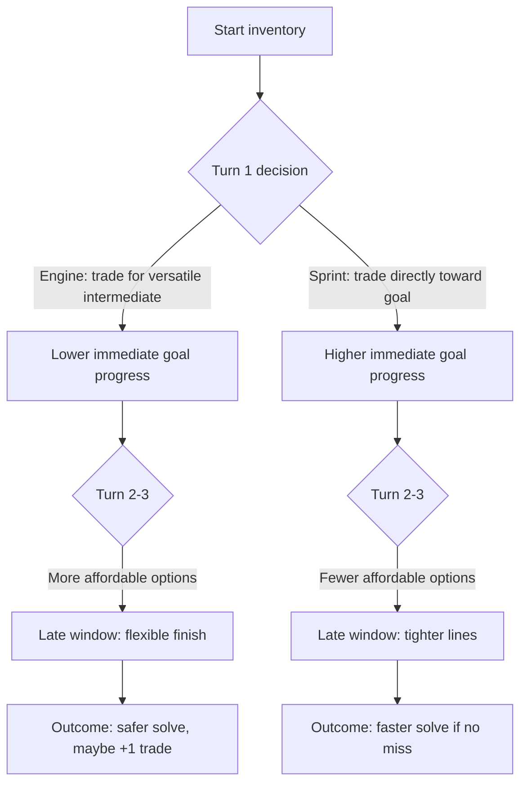
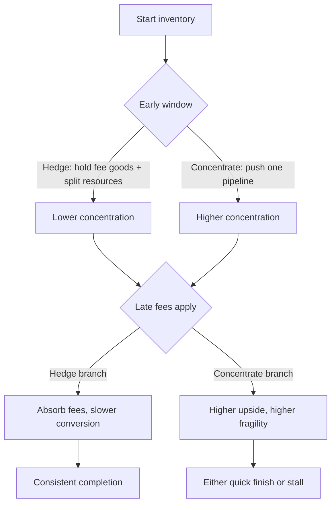
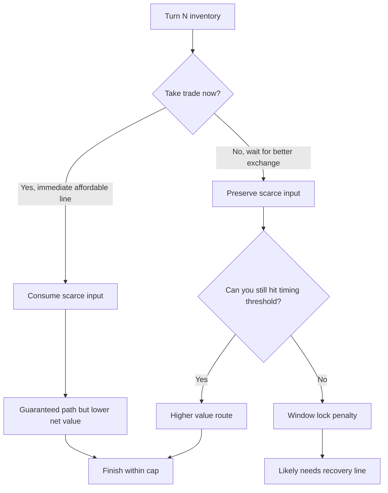
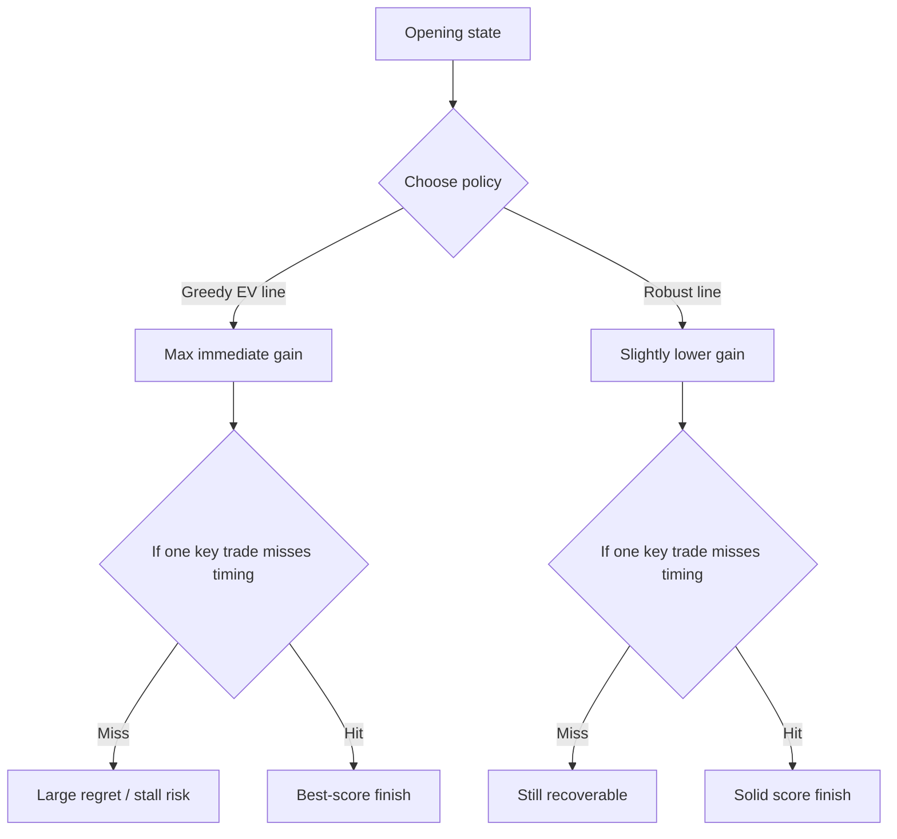
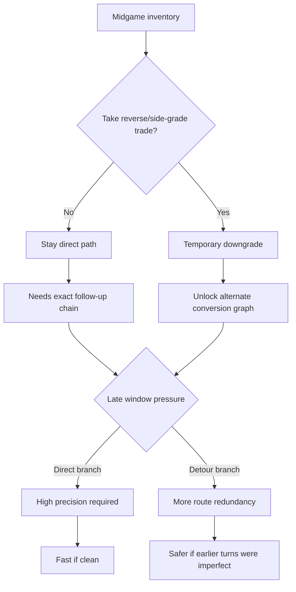

# Barter puzzle generation: macro-strategy flowchart examples

This document captures five internal puzzle archetypes for generator validation.  
These are **not** player-facing labels; they are internal quality targets.

## 1) Engine vs Sprint

Player tradeoff: short-term tempo vs long-term flexibility.

---

## 2) Hedge vs Concentrate

Player tradeoff: robustness vs peak efficiency.

---

## 3) Tempo vs Value

Player tradeoff: timing certainty vs exchange efficiency.

---

## 4) Robust vs Greedy

Player tradeoff: upside maximization vs regret minimization.

---

## 5) Sacrifice-and-Recover detour

Player tradeoff: apparent backward move now for wider comeback potential later.
